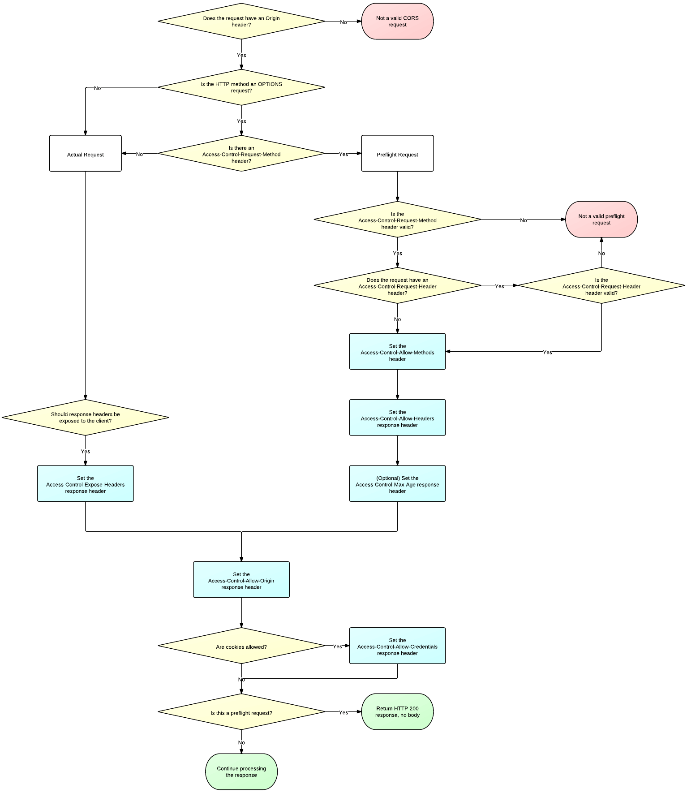

# Options

HTTP的 <b>OPTIONS 方法</b> 用于获取木的资源所支持的通信选项。客户端可以对特定的URL使用 OPTIONS 方法，也可以对整个站，(通过URL设置为"*")使用这个方法。

## Syntax

```
OPTIONS /index.html HTTP/1.1
OPTIONS * HTTP/1.1
```

## Example

### 检测服务器所支持的请求方法

可以使用 <i>OPTIONS</i>方法怼服务器发起请求，检测服务器支持哪些HTTP方法:

> curl -X OPTIONS http://example.org -i

响应一个<b>Allow</b>首部字段,这个字段表明了服务器支持的所有HTTP方法:

```
HTTP/1.1 200 OK
Allow: OPTIONS, GET, HEAD, POST
Cache-Control: max-age=604800
Date: Thum 13 Oct 2018 11:45:00 GMT 
Expires: Thum 20 Oc t2018 11:45:00 GMT 
Server: EOS (lax004/2813)
x-ec-custom-error: 1
Content-Length: 0
```

## CORS 预检测

在CORS中，可以使用OPTIONS方法发起一个预检测请求，来检测实际请求是否可以被服务器接受。预检测请求报文中的<i>Access-Control-Request-Method</i>首部字段告知服务器实际请求所使用的HTTP方法；<i>Access-Control-Request-Headers</i>首部字段告知服务器实际请求所携带的自定义首部字段。服务器基于从预检测请求获得的信息来判断，是否接收接下来的实际请求。

```
OPTIONS /resources/post-here/ HTTP/1.1
Host: bar.other
Accept: text/html,application/xhtml+xml,application/xml;q=0.9,/*/;q=0.8
Accept-Language: en-us,en;q=0.5
Accept-Encoding: gizp,default
Accept-Charset: ISO-8859-1,utf-8;q=0.7,*;q=0.7
Connection: keep-alive
Origin: http://foo.example
Access-Control-Request-Method: POST
Access-Control-Request-Headers: X-PINGOTHER, Content-Type
```

服务器所返回的 Access-Control-Allow-Methods 首部字段将所有允许的请求方法告知客户端。但是只能在<i>CORS</i>的场景中使用。

```
HTTP/1.1 200 OK
Date: Mon, 01 Dec 2018 01:15:38 GMT
Server: Apache/2.0.61 (Unix)
Access-Control-Allow-Origin: http://foo.example 
Access-Control-Allow-Methods: POST, GET, OPTIONS 
Access-Control-Allow-Headers: X-PINGOTHER, Content-Type 
Access-Control-Max-Age: 86400 
Vary: Accept-Encoding, Origin 
Content-Encoding: gzip 
Content-Length: 0 
Keep-Alive: timeout=2, max=100 
Connection: Keep-Alive 
Content-Type: text/plain
```

## 图例



## 总结

大概就是在发送请求之前会判断一下服务器是否支持这个请求。在特定情况下针对不同的源来提出请求时，这是必须的，这是因为某些浏览器作为安全措施确保服务器信任所完成的请求，这意味着服务器明白在请求上发送的方法，起源和头文件可以安全地执行，这时候服务器不应该忽略。